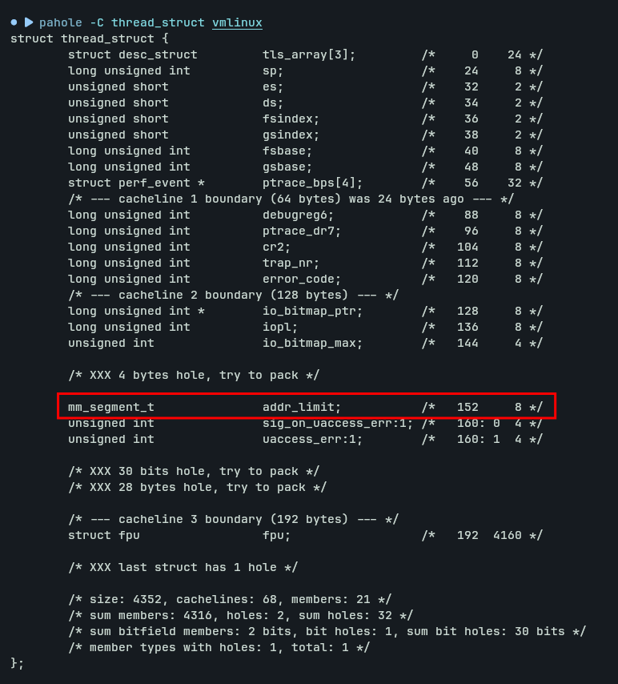
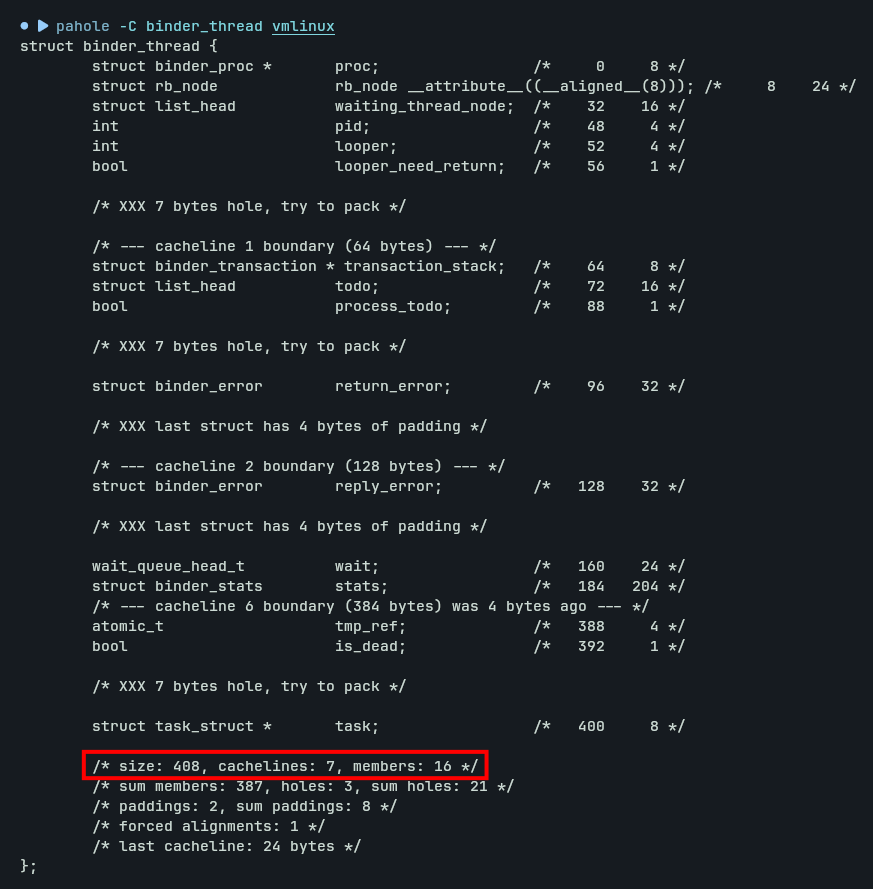
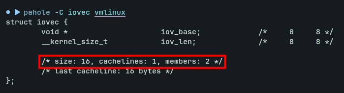
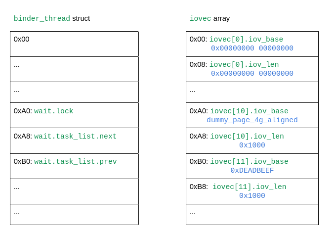
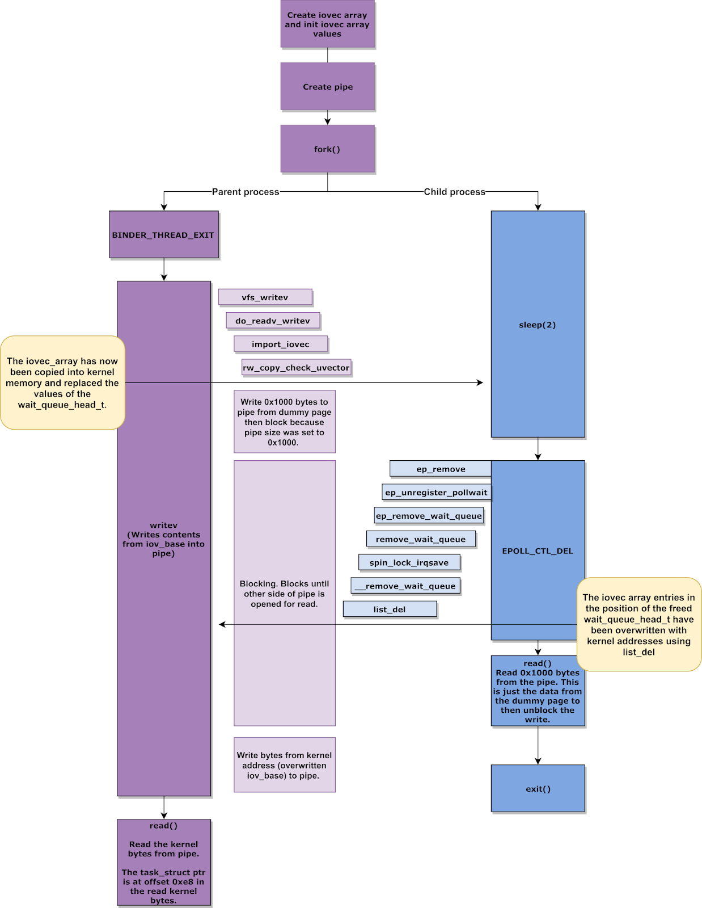
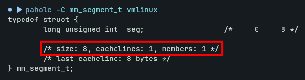
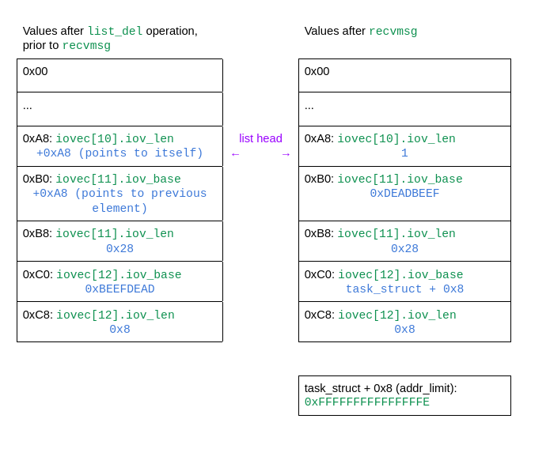
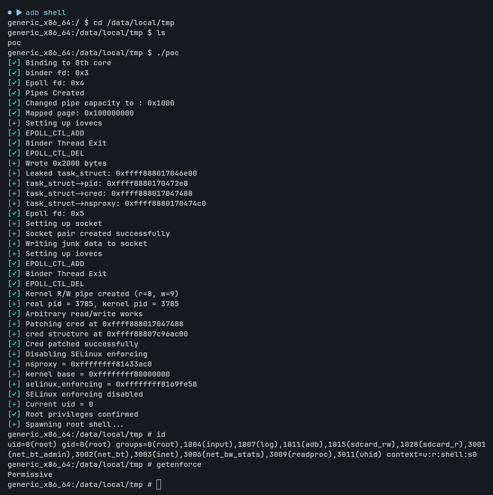

# CVE-2019-2215 - Android Binder UAF Local Privilege Escalation

A rewritten Proof-of-Concept / Local Privilege Escalation (LPE) exploit targeting **CVE-2019-2215**, a Use-After-Free vulnerability in the Android Binder driver.

## Technical Details of the Bug

For the techinical details of the bug you can learn that from this amazing blog https://projectzero.google/2019/11/bad-binder-android-in-wild-exploit.html

## Key takeaways

`task_struct` structure has an important member `addr_limit` of type `mm_segment_t`. `addr_limit` stores the highest valid user space address. `addr_limit` is part of `struct thread_info` or `struct thread_struct` depending on the target architecture. As we are now dealing with x86_64 bit system, `addr_limit` is defined in `struct thread_struct`.

If we can clobber this `addr_limit` with `0xFFFFFFFFFFFFFFFF`, we will be able to read and write to any part of the kernel space memory. For the better compatibility of the exploit on `x86_64` and `arm64`, it's better to set `addr_limit` to `0xFFFFFFFFFFFFFFFE`

`struct iovec` is used for `Vectored I/O` also know as `Scatter/Gather I/O`. One of the main issue with `struct iovec` is that they are short lived. They are allocated by system calls when they are working with the buffers and immediately freed when they return to user mode.

We want the `iovec` structure to stay in kernel when we trigger the unlink operation and overwrite the `iov_base` pointer with the address of `binder_thread->wait.head` to gain scoped read and write. One way is to use system calls like `readv`, `writev` on a `pipe` file descriptor because it can block if the `pipe` is full or empty. `pipe` is an unidirectional data channel that can be used for interprocess communication. The blocking feature of `pipe` gives us significant time window to corrupt `iovec` structure in kernel space.

In the same manner we can use `recvmsg` system call to block by passing `MSG_WAITALL` as the flag parameter.

## Leaking task_struct

As the size of the `binder_thread` structure is `408` bytes, it will end up in `kmalloc-512` cache. 

we will need to stack up `25 iovec` structures to reallocate the dangling chunk. `408 / 16 = 25.5`

As we can see from the above image, `iovecStack[10].iov_len` and `iovecStack[11].iov_base` will be clobbered.

So, we would want to process `iovecStack[10]`, block `writev` system call and then trigger the `unlink` operation. This will ensure that when `iovecStack[11].iov_base` is clobbered, we will resume the `writev` system call. Then finally, leak the content of the `binder_thread` chunk back to user space and read `task_struct` pointer from it

## Clobber addr_limit

For achieving scoped `write`, we are going to use `recvmsg` system call to block by passing `MSG_WAITALL` as the flag parameter. `recvmsg` system call can block just like `writev` system call.

As the size of `mm_segment_t` is `0x8` bytes, we would want to clobber it with `0xFFFFFFFFFFFFFFFE` as it's the highest valid kernel space address and will not crash the process if page fault occurs in `arm64` system.

## Exploit In Action 

